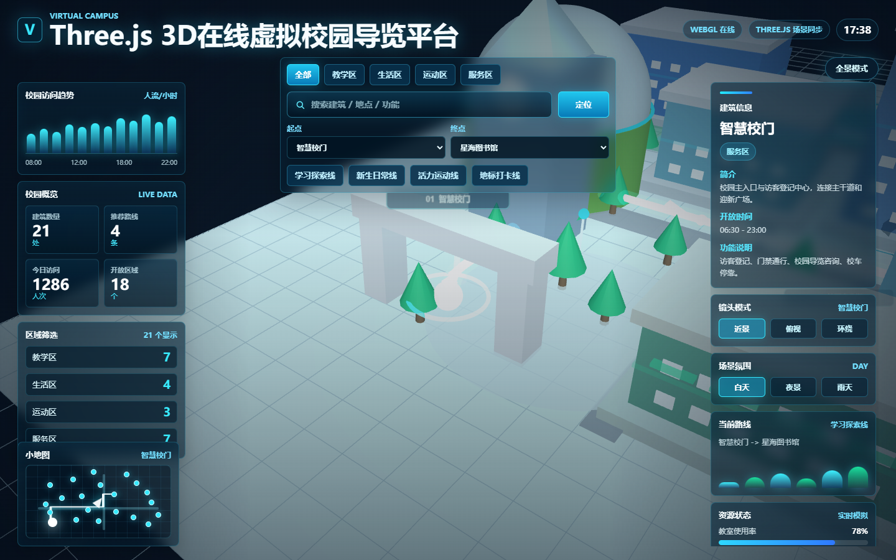
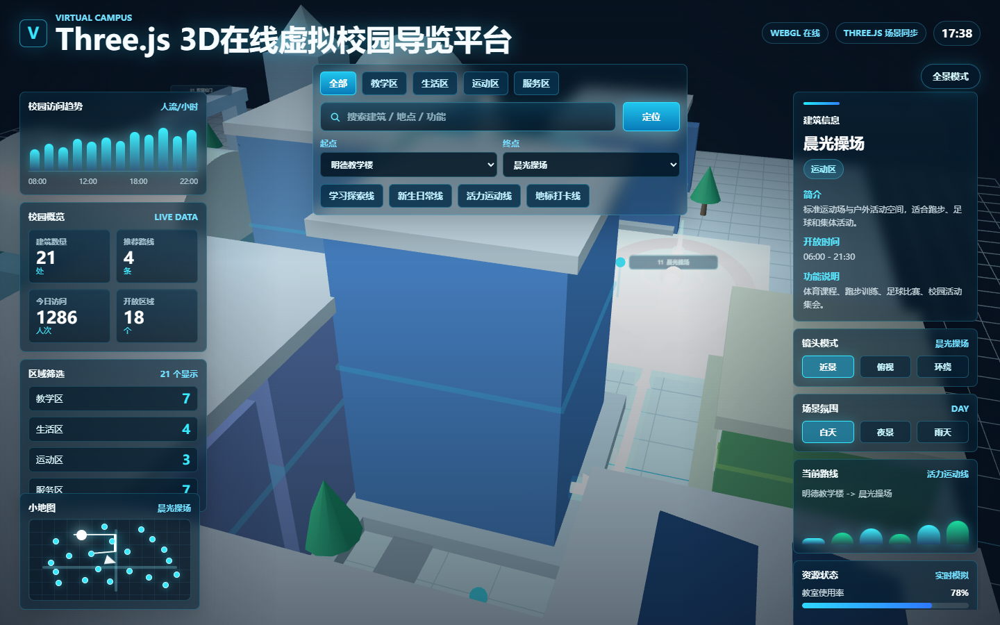
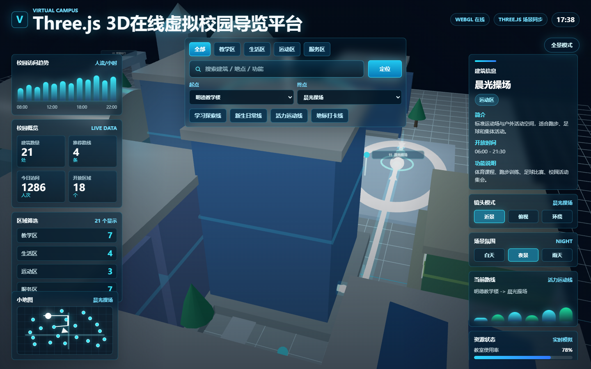
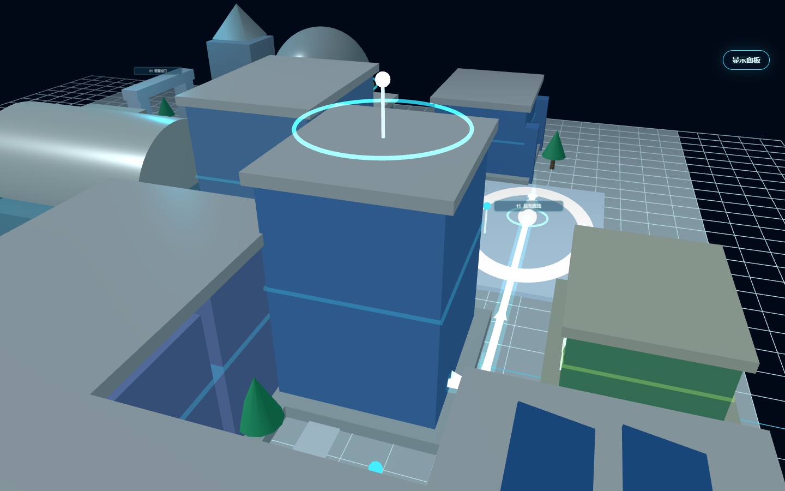

# 在线虚拟校园导览

一个基于 Vue 3、Vite 和 Three.js 的在线虚拟校园导览前端项目。项目以 3D 校园场景作为主视觉，结合数字孪生大屏 HUD、建筑信息面板、路线导航、小地图、场景氛围切换等功能，展示一个轻量但完整的校园导览原型。

校园建筑由 Three.js 基础几何体和自定义组件搭建，不依赖外部大型模型文件，适合作为 WebGL 场景搭建、前端可视化大屏和交互式导览系统的学习与展示项目。

## 项目截图

### 数字孪生导览大屏



### 路线导航与建筑聚焦



### 夜景模式



### 全景模式



## 功能特点

- 3D 校园导览：包含校门、教学楼、图书馆、宿舍、食堂、操场、实验中心、服务中心等校园建筑。
- 数字孪生大屏：左右叠加访问趋势、区域概览、建筑信息、资源状态、路线统计等 HUD 面板。
- 建筑交互：点击建筑后高亮并展示名称、分类、简介、开放时间和功能说明。
- 分类筛选：支持教学区、生活区、运动区、服务区等建筑分类切换。
- 搜索定位：可按建筑名称或功能搜索，并自动聚焦到目标建筑。
- 路线导航：选择起点和终点后，在 3D 场景中显示发光路线，并同步到小地图。
- 镜头控制：提供近景、俯视、环绕等视角模式。
- 场景氛围：支持白天、夜景、雨天模式切换。
- 全景浏览：隐藏 HUD 面板后可沉浸式查看 3D 校园场景。
- 设备图层：在楼栋上叠加电梯、空调、照明、水泵四类设备，支持按楼栋、设备类型筛选和只看异常，异常设备红色光晕闪烁。
- 设备详情：点击任意设备镜头平滑飞抵并弹出详情卡，展示温度、功率、运行时长等实时参数与近 24 小时曲线。
- 能耗监控：按楼栋和设备类型统计当日分时与近七天用电，图表化展示，支持一键下发节能模式并联动场景与面板状态。
- 告警中心：异常设备自动生成告警，可逐条标记已处理，未处理数量以角标提醒，点击告警可在三维场景中定位设备。
- 状态联动与持久化：设备图层、筛选条件、节能模式和告警处理结果在图层、面板、图表与三维场景间实时同步，刷新后保留。
- 本地 mock 数据：无需后端服务，开箱即可运行。

## 技术栈

- Vue 3
- Vite
- Three.js
- OrbitControls
- JavaScript
- CSS3

## 运行方式

安装依赖：

```bash
npm install
```

启动开发环境：

```bash
npm run dev
```

构建生产包：

```bash
npm run build
```

## 目录结构

```text
src/
  components/
    CampusScene.vue       # Three.js 校园场景
    ControlPanel.vue      # 搜索、筛选和路线控制
    InfoPanel.vue         # 建筑信息面板
    StatsCards.vue        # 数据卡片
    OpsDock.vue           # 设备运维控制坞（设备图层 / 能耗统计 / 告警中心）
    DeviceLayerPanel.vue  # 设备筛选与设备列表
    EnergyPanel.vue       # 能耗统计图表与节能模式下发
    AlertPanel.vue        # 告警中心
    DeviceDetailCard.vue  # 设备实时参数详情卡与曲线
  mock/
    campusData.js         # 校园建筑与推荐路线数据
    deviceData.js         # 校园设备、遥测曲线与故障 mock 数据
  store/
    deviceStore.js        # 设备筛选、能耗、告警、节能模式状态与本地持久化
  styles/
    global.css            # 全局样式与大屏 UI
  three/
    builders/
      primitives.js       # 基础几何体构建工具
      deviceMarkers.js    # 四类设备的三维标记与故障光晕
  utils/
    pathfinding.js        # 校园路径计算与小地图坐标
  App.vue
  main.js
```

## 设计说明

这个项目更偏向“可视化作品集项目”而不是传统管理系统：重点放在 3D 场景组织、镜头运动、建筑选中反馈、路径可视化、HUD 信息层和沉浸式全景体验上。它可以继续扩展为真实校园导览、园区数字孪生、展馆导航或景区导览系统。
